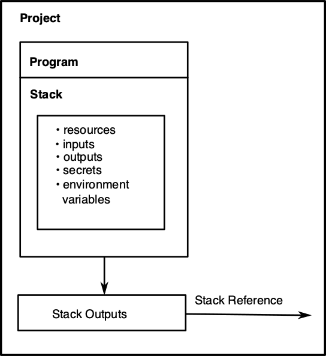
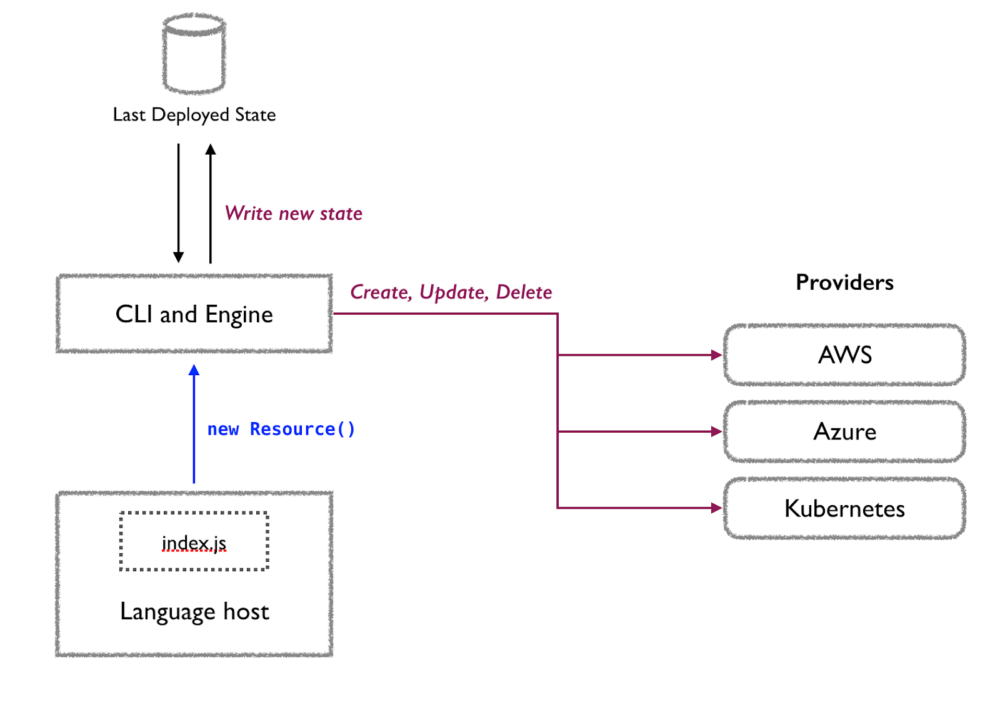

## Concepts {#concepts}

In this section, we introduce the basic concepts required to start declaring your infrastructure with Pulumi. Throughout the remainder of this page, we'll examine the ins and outs of Pulumi's programming model concepts.

## Pulumi Programming Model {#pulumi-programming-model}

This diagram illustrates the structure of the Pulumi programming model.

### Definitions

Here are explanations of each component of the programming model.

**Project**. A Pulumi [project]() contains code for declaring infrastructure. It has a name and instructions on how to run the code. The project folder also contains the default stack configuration files.

**Program**. A program is the code for building infrastructure and organizing them into stacks.Pulumi programs are written in general-purpose programming languages, including JavaScript, TypeScript, Python, Go or any .NET language such as C#, F#, or VB. You use the language’s native tools and libraries, including Pulumi’s own packages containing infrastructure resource types.

Although you use general-purpose languages, Pulumi is still a declarative infrastructure as code tool. After writing a program, you run the Pulumi CLI command `pulumi up`, which executes the program and determines the desired infrastructure state for all resources declared. The CLI will show you a preview of changes to be made, including all new resources to be created and existing resources to update or destroy. After confirming, Pulumi will carry out the changes.

**Stack**. [Stacks]() are an instantiation of a program and contain a collection of cloud resources. A project can have multiple stacks. Stacks are similar to environments. For example, a project might have a dev stack,  a test stack and a production stack.

**Resource**. A [resource]() represents a type of infrastructure, such as a compute instance. Resources can be aggregated together as component resources

**Resource Provider**. A [resource provider]() A resource provider handles  communications  with a cloud service to create, read, update, and delete the resources you define in your Pulumi programs.

**Inputs**. A resource has [inputs]() that represent the properties and dependencies between resources. An example of an input is the connection string to a database.

**Outputs**. A resource has [outputs]() that are properties of the resource instance. Outputs are also how Pulumi tracks dependencies between resources.

**Secrets**. One type of input is a [secret](). Secrets are private data, such as passwords, used by a resource. Secrets can be encrypted.

**Environment Variables**. Another type of input are [environment variables](), which the stack requires to deploy the infrastructure correctly. An example of an environment variable is the AWS region where you will deploy your infrastructure.

**Stack Outputs**. A [stack output]() consists of the properties that a stack exports, such as a domain name or a Kubernetes kubeconfig file.

**Stack References**. A [stack reference]() connects the exported properties of one stack to another stack. For example, you can declare a Kubernetes cluster in one stack which consumes services in another stack.

### How the model works {#how-the-model-works}

A Pulumi project is a directory that contains the configuration files and the code. The code declares the infrastructure you want. The configuration files tell the Pulumi CLI how to run the code and can contain project information such as environment variables and secrets.

When you run a program, via the pulumi up command, it instantiates a stack, which contains the infrastructure resources declared in the code. Resources can take inputs such as the port number for a service created by a resource. The stack can also export outputs, such as an IP address, which can be used by you or by another stack via a stack reference.

The Pulumi programming model lets you use imperative programming languages to declare infrastructure. Pulumi SDKs abstract cloud resources so that you can set their properties by using a programming language. They are instantiated declaratively by the Pulumi CLI. The advantage of using code is that you can extend or combine resources to build infrastructure to your design.

## Pulumi Environment {#pulumi-environment}

Here are explanations of each component of the Pulumi environment.

### Definitions

**Cloud Service Provider**. Any company or organization that manages cloud services.

**Pulumi engine**. The Pulumi engine runs the set of operations that can create infrastructure or move it from its current state to its desired state.

**Resource Provider**. A resource provider communicates with the cloud service to create the declared infrastructure.

**Language Host**. The language host runs a Pulumi program and sets up an environment where it can register resources with the deployment engine.

**Program State**. Pulumi stores a copy of the current state of your infrastructure. This is often called state and is stored in transactional snapshots called checkpoints. Pulumi records checkpoints at various points so that it can differentiate between the goal state and the current state during an update, recover from a failure, or destroy resources.

### How Pulumi Deploys Resources

Pulumi uses a desired state model for managing infrastructure. A language host executes a Pulumi program to compute a desired state for a stack’s infrastructure. The deployment engine (this is different from the Pulumi engine) compares this desired state with the stack’s current state and determines what resources need to be created, updated or deleted. The engine uses a set of resource providers (such as AWS or Azure) to manage the individual resources. As it operates, the engine updates the state of your infrastructure with information about all resources that have been provisioned as well as any pending operations.

The following diagram illustrates the interaction between the components that make up the Pulumi environment.

### Language Hosts

The language host is responsible for running a Pulumi program and setting up an environment where it can register resources with the deployment engine. The language host has two pieces:

- A language executor, which is a binary named `pulumi-language-<language-name>`, which Pulumi uses to launch the runtime for the language your program is written in (e.g. Node or Python). This binary is distributed with the Pulumi CLI.

- A language runtime, which prepares your program for execution and observes its execution in order to detect resource registrations. When a resource is registered (for example, via `new Resource()` in JavaScript or `Resource(...)` in Python), the language runtime communicates the registration request back to the deployment engine.

    The language runtime is distributed as a regular package, just like any other code that might depend on your program. For example, the Node runtime is contained in the `@pulumi/pulumi` package available on npm, and the Python runtime is contained in the `pulumi` package available on PyPI.

### Deployment Engine

The deployment engine is embedded in the Pulumi CLI. The deployment engine computes the set of operations that will move  the current state of your infrastructure to the desired state. When the deployment engine receives a resource registration from the language host, the engine examines the existing state to determine if that resource already exists. . If it doesn’t, , the engine uses a resource provider to create it on the cloud service. If it already exists, the engine works with the resource provider to determine if anything has changed by comparing the old state of the resource with the new, desired state. If there are changes, the engine determines if it can update the current resource or if it must replace it by creating a new version and deleting the old version. The decision depends on what resource properties are changing and the type of the resource itself. When the language host reports to the deployment engine that it has executed the Pulumi program, the engine looks for any existing resources without a new resource registration and schedules these resources for deletion.

### Resource Providers

A resource provider has two pieces:

- A resource plugin, which is the binary the deployment engine uses to manage a resource. These plugins are stored in the plugin cache (located in `~/.pulumi/plugins`). You can manage them with  the Pulumi plugin commands.

- An SDK which provides bindings for each type of resource the provider can manage. Like the language runtime itself, the SDKs are available as regular packages. For example, there is a `@pulumi/aws` package for Node, which is available on npm and a `pulumi_aws` package for Python, which is available on PyPI. When these packages are added to your project, they run `pulumi plugin install` behind the scenes in order to download the resource plugin from pulumi.com.

### State

State is critical to how Pulumi operates. Pulumi stores a copy of the current infrastructure state. State is stored in transactional snapshots called checkpoints. A checkpoint is recorded by Pulumi at various points so that it can  diff between the goal state and the current state during an update, recovering from failure, or destroying resources.

## Summary

Building infrastructure with Pulumi requires a program to declare the infrastructure and the Pulumi environment to deploy and manage that infrastructure. There are two main differences between using your favorite programming language to write a program versus using  a YAML or JSON [DSL]() to declare infrastructure. One is that a programming language allows you to extend or combine resources. The other difference is that you can take advantage of the language’s software engineering tools such as IDEs, testing frameworks, and versioning.

The following documents will give you a deeper understanding of the Pulumi programming model.
