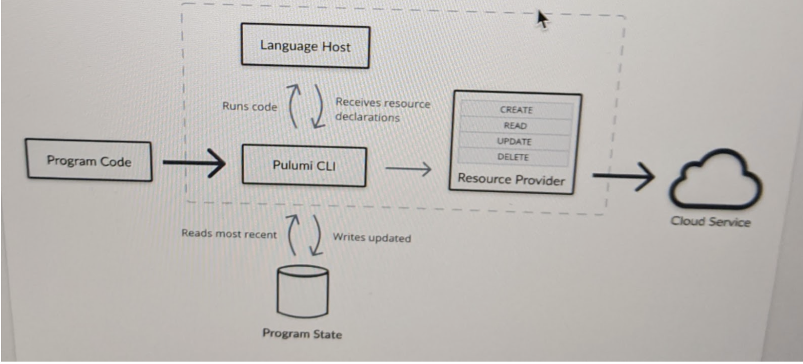

In this document, you’ll learn the basics of Pulumi projects and programs. We’ll show you how to create a project and then show you an example of a simple Pulumi program. We’ll give you an overview of a program’s structure and then show you what happens when you run a program.

## Projects {#pulumi-yaml}

A Pulumi project is a name and instructions for running a program. You must create a project before you create a program.

The simplest way to create a new project is with the Pulumi CLI and the `new` command.

> Assume that all the commands in this document happen in the CLI.

This example creates a new project for programs written in Typescript that creates infrastructure on AWS. (If you’re following along, first create a new directory and move to it.)

```bash
$ mkdir myproject && cd myproject
$ pulumi new aws-typescript
This command will walk you through creating a new Pulumi project.

Enter a value or leave blank to accept the (default), and press <ENTER>.
Press ^C at any time to quit.

project name: (bucket-ts)
project description: (A minimal AWS TypeScript Pulumi program)
Created project 'bucket-ts'

Please enter your desired stack name.
To create a stack in an organization, use the format <org-name>/<stack-name> (e.g. `acmecorp/dev`).
stack name: (dev)
Created stack 'dev'

aws:region: The AWS region to deploy into: (us-east-1) us-west-2
Saved config

Installing dependencies...
Your new project is ready to go! ✨

To perform an initial deployment, run 'pulumi up'
```

The command creates a project folder that contains:

- Pulumi.yaml
- Pulumi.<stack name>.yaml
- package.json file for managing dependencies
- tsconfig.json file for setting compiler options
- an index.ts file with a minimal Pulumi program.

The `Pulumi.yaml` project file specifies metadata about your project.

> This file must begin with a capitalized `P`, although either `.yml` or `.yaml` extension will work.

A typical `Pulumi.yaml` file looks like the following:

```yaml
name: webserver
runtime: nodejs
description: Basic example of an AWS web server accessible over HTTP.
```

A project file contains the following attributes:

- `name`: (required) a name for your project.  This shows up in the Pulumi dashboard and is used to aggregate the
  associated stacks and their resources underneath the project, as a simple kind of hierarchy.  Project names may only contain alphanumeric characters, hyphens, underscores, or periods.

- `runtime`: (required) (`string`|`object`) the language runtime configuration to use for your program.  Possible string options are `nodejs`
  (for JavaScript and TypeScript), `python` (for Python),`go` (for Go), and `dotnet` (for .NET).  At the moment, Pulumi doesn't depend on specific versions
  of these runtimes, and will simply use whatever version you have installed on your machine.
    - `name`: `runtime` can either be specified as a string, or a complex object with additional configuration. If you need to include additional configuration, specify language information (`nodejs`, `python`, `go`, or `dotnet`) in this property.
    - `options`: (optional) a property bag that has various configuration options that apply to different language runtimes.
        - `typescript`: applies to Node.js projects only. A boolean (`true` | `false`) controls whether to use ts-node to execute sources. Defaults to `true`.
        - `binary`: applies to Go and .NET projects only
            - **Go**: A string that specifies the name of a pre-built executable to look for on your path. If not specified, go sources in $CWD will be invoked via `go run`.
            - **.NET**: A string that specifies the path of a pre-built .NET assembly. If not specified, a .NET project in $CWD will be invoked via `dotnet run`.
        - `virtualenv`: applies to Python projects only. A string that specifies the path to a virtual environment to use when running the program. New Python projects created with `pulumi new` have this option set by default. If not specified, Pulumi will invoke the `python3` command it finds on $PATH (falling back to `python`) to run the Python program. If you'd like to use a virtual environment without the `virtualenv` option, you'll need to run any `pulumi` commands (such as `pulumi up`) from an activated virtual environment shell (or, if using a tool like [Pipenv](https://github.com/pypa/pipenv), prefix any `pulumi` commands with `pipenv run pulumi ...`).

- `description`: (optional) a friendly description about your project.

- `main`: (optional) an override for the main program's location. By default, the program's working directory is assumed to be the location of `Pulumi.yaml`. To choose a different location, use the `main` property. For example, if your Pulumi program is in a subdirectory `infra/`, use `main: infra/`.

- `config`: (optional) directory to store stack-specific configuration files, relative to location of `Pulumi.yaml`.

- `backend`: (optional) configuration for project state [backend](). Supports these options:
    - `url`: explicitly specify backend URL like `https://pulumi.acmecorp.com`, `file:///app/data`, etc.

- `template`: (optional) provides configuration settings that will be used when initializing a new stack from a project file using `pulumi new`. Currently these values are *only- used by `pulumi new`, and not by `pulumi stack init` or as default configuration for existing stacks.
    - `description`: (optional) a description for the template itself.
    - `config`: (required) the map of configuration values keyed by the name of the config setting - such as `aws:region`.  The value of each key includes:
        - `description`: (optional) a description for the config setting.
        - `default`: (optional) the default value of the config setting - which will be presented to the user as a default.
        - `secret`: (optional) if `true` indicates that this configration value should be marked as secret.

When using JavaScript, the working directory for the project should contain a `package.json` that points to a file such as `index.js`. In Python, there should either be a `__main__.py` file or a file `setup.py` that defines the entry point.



{}

A `Pulumi.yaml` file for a `nodejs` program that does not execute TypeScript natively via `ts-node`:

```yaml
name: minimal
description: A minimal Pulumi program.
runtime:
  name: nodejs
  options:
    typescript: false
```

{}
{}

A `Pulumi.yaml` file for a `nodejs` program with TypeScript:

```yaml
name: minimal
description: A minimal Pulumi program.
runtime:
  name: nodejs
  options:
    typescript: true
```

{}
{}

A `Pulumi.yaml` file for a `go` program that will only use a pre-built executable by the name `mybinary`:

```yaml
name: ls
runtime:
    name: go
    options:
        binary: mybinary
description: A minimal Go Pulumi program
```

{}
{}

A `Pulumi.yaml` file for a `dotnet` program that will use a pre-built assembly `MyInfra.dll` under the `bin` directory:

```yaml
name: ls
runtime:
    name: dotnet
    options:
        binary: bin/MyInfra.dll
description: A precompiled .NET Pulumi program
```

{}



### Paths

When your Pulumi program references resources in the local filesystem, they are always relative to the working directory. The following example code references a subfolder `app` of the working directory, which would contain a `Dockerfile` and application code:



{}

```javascript
const myTask = new cloud.Task("myTask", {
    build: "./app", // subfolder of working directory
    ...
});
```

{}
{}

```typescript
const myTask = new cloud.Task("myTask", {
    build: "./app", // subfolder of working directory
    ...
});
```

{}
{}

```python
myTask = Task('myTask',
    spec={
        'build': './app' # subfolder of working directory
        ...
    }
)
```

{}
{}

```csharp
var myTask = new Task("myTask", new TaskArgs
{
    Build = "./app", // subfolder of working directory
    ...
});
```

{}



## Stacks

A stack is an instance of a program. You can think of a stack as being similar to an environment. For instance you might have a dev stack, a test stack, and a production stack, each of them configured differently. Because you can have as many stacks as you want, a project can have multiple stack configuration files. The naming convention for these files is Pulumi.stackname.yaml. For example, the configuration file for the dev stack is Pulumi.dev.yaml.

By default, Pulumi creates a stack named dev. In our example, this stack will contain the infrastructure necessary to set up an S3 bucket on AWS.

To create a different stack with a different name, use this command:

`stack name: name`

To create an empty stack, use this command:

```bash
stack init
```

For a list of all the options available with the [init command]().

There’s much more to learn about stacks. For more information, see [Stacks]().

### Stack Settings Files {#stack-settings-file}

Each stack that is created in a project will have a file named `Pulumi.<stackname>.yaml` which contains the configuration specific to this stack.

For stacks that are actively developed by multiple members of a team, the recommended practice is to check them into source control as a means of collaboration. Since secret values are encrypted, it is safe to check in these stack settings.

For stacks that are ephemeral or are used in "inner loop" development, the stack settings are typically not checked into source control.

For more information about configuration and how this file is managed using the CLI and programming model, refer to [Configuration and Secrets]().

### Resources

A stack contains resources. Resources are the pieces that make up your infrastructure. The S3 bucket in our program is an example of a resource. What resources are available and what they’re called depends on the cloud provider you’re using. For more information about resources, see [Resources]().

## Relationships between Projects, Programs and Stacks

This diagram shows a simplified version of the relationships between projects, programs and stacks.

```bash
Project
|
|_ Program
   |
   |_ Stack
      |
      |_ Resources

```

A program is always a part of a project. A program, when it runs, creates stacks and stacks contain resources.

## Verify Your Program

Before creating resources on a cloud provider, verify that your program will create the resources you want. To do this, use the preview command. You’ll see an output something like this:

```bash
$ pulumi preview
Previewing update (dev)

View Live: https://app.pulumi.com/spara/bucket-ts/dev/previews/32dfbf67-6a12-4616-b920-415f6be277d3

     Type                 Name           Plan
 +   pulumi:pulumi:Stack  minimalist-dev  create
 +   └─ aws:s3:Bucket     my-bucket      create

Resources:
    + 2 to create
```

You’ll see that the program will create two resources. One resource is the dev stack, which is an instance of `pulumi:pulumi:Stack`. The stacks contains an instance of the Bucket class. Each resource has a name and the plan is to create those resources on AWS.

## Deploy to AWS

You’re finally ready to create your infrastructure. To do that, use the `up` command (up is short for update). You should see something like this.

```bash
$ pulumi up -f
Updating (dev)

View Live: https://app.pulumi.com/spara/bucket-ts/dev/updates/2

     Type                 Name           Status
     pulumi:pulumi:Stack  bucket-ts-dev

Outputs:
    bucketName: "my-bucket-3247fdd"

Resources:
    2 unchanged

Duration: 2s
```

 > Note: To create the dev stack on AWS, you’ll need an AWS account and your credentials. Of course, if you’re using another cloud provider, the same requirements apply.

You can go to the AWS Management Console to verify that the infrastructure exists. You can also use the [Pulumi Console](https://app.pulumi.com) to keep track of your projects and the stacks you’ve created. For more information, see [Pulumi Console]().

## What Happened?

This diagram shows what happened when you ran `pulumi up`.



The Pulumi CLI determined that your chosen language was TypeScript and that the program code should run with Node.js. It launched the Node language host and passed it the code. It then waited to receive the resource declarations from the language host.

Before Pulumi creates any resources, it evaluates the current state of the infrastructure by looking at a the [Pulumi Service]() which maintains the state of infrastructure. In our example, the CLI determines that the Bucket instance don’t exist and it needs to be created and configured.

The CLI gives a list of the necessary operations to the resource provider. The resource provider handles communications between Pulumi and the cloud service. In our case, it translates the list of operations into the appropriate AWS APIs and sends them to the AWS service to deploy the infrastructure. To learn more about resource providers, see [Providers]().

Once the resources are created, Pulumi updates the stack state and saves it in the Pulumi Service database.
