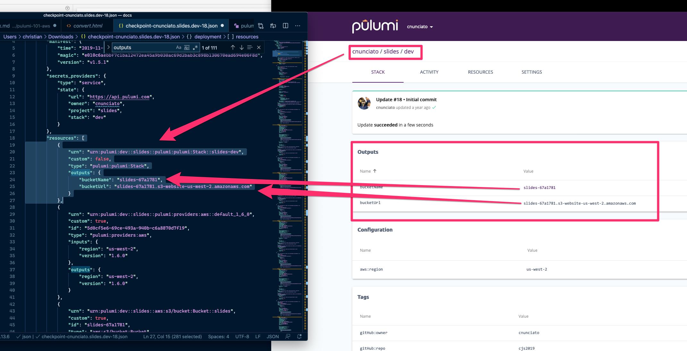

A resource represents one or more pieces in your infrastructure. For example, a resource might represent a compute instance or an S3 bucket on AWS. All infrastructure resources are described by one of two subclasses of the [`Resource`()]class. These two subclasses are:

- [`CustomResource`](): A custom resource is the most common kind of resource. A custom resource is a resource managed by a resource provider.  (A resource provider creates the infrastructure you’ve described in your program in the cloud service you’ve selected. For more information about resource providers, see [Providers]().)
- [`ComponentResource`](): A component resource is an aggregation of many resources that forms a larger abstraction.

## Resource Libraries

Pulumi has libraries for AWS, Google, Azure, with Kubernetes, as well as other services. These libraries describe all the resources that each cloud service offers. When you write a program, you import the relevant library package. Here are links to the current resource libraries:

## Custom Resources

A custom resource’s desired state is declared by constructing an instance:

```python
res = Resource(name, args, options)
```

All resources have a required [`name`]() argument, which must be unique across resources of the same kind in a [`stack`](). This logical name influences the physical name assigned by your infrastructure’s cloud provider.  [Pulumi auto-names physical resources]() by default, so the physical name and the logical name may differ. (For more information about auto-naming, see [Physical Names and Auto-Naming](), below.

The `args` argument is an object with a set of named property input values that are used to initialize the resource. These can be normal raw values—such as strings, integers, lists, and maps—or [outputs from other resources](). For more information, see [Inputs and Outputs]().

The `options` argument is optional, but [lets you control certain aspects of the resource](). For example, you can show explicit dependencies, use a custom provider configuration, or import an existing infrastructure. For more information, [Resource Options]()  later in this document.

## Declaring Infrastructure

To declare new infrastructure in your program, allocate a resource object whose properties correspond to the desired state of your infrastructure. For example, this program creates a new AWS EC2 security group and an instance that uses it:

```python
import pulumi_aws as aws

group = aws.ec2.SecurityGroup('web-sg',
    description='Enable HTTP access',
    ingress=[
        { 'protocol': 'tcp', 'from_port': 80, 'to_port': 80, 'cidr_blocks': ['0.0.0.0/0'] }
    ])

server = aws.ec2.Instance('web-server',
    ami='ami-6869aa05',
    instance_type='t2.micro',
    security_groups=[group.name]) # reference the security group resource
```

In this example, the two resource objects, `group` and `server`, plus their logical names and properties, tell Pulumi everything it needs to create, update, or delete your infrastructure. For example, Pulumi now knows you’d like an EC2 security group named `web-sg` with a single ingress rule, and a `t2.micro`-sized EC2 instance that runs AMI `ami-8689aa05` and uses the `web-sg` security group.

Thanks to [output properties](), Pulumi understands the dependencies between resources. Pulumi uses that information to create a dependency graph of resources. With that graph, it can maximize parallelism and ensure correct ordering. When you run the `pulumi up` command, Pulumi computes the desired state, compares it to the current infrastructure (if present), shows the delta, and confirms and carries out the changes.

You can export the resulting infrastructure values if you want to access them outside your application. For example, adding this code to the example exports the server’s resulting IP address and DNS name:

```python
# ...
pulumi.export('public_ip', server.public_ip)
pulumi.export('public_dns', server.public_dns)
```

The exported values are printed after you do a `pulumi up` and they are easy to access from the CLI’s `pulumi stack output` command. To learn more, see [stack outputs]().

The export call/expression stores the computed values on the stack's checkpoint (this is a state file, the JSON-serialized representation of the stack as of the last update), which makes them available as stack "outputs" -- values you can reference programmatically or with the CLI:



You can run commands such as `pulumi stack output bucketUrl` to get a specific value, or `pulumi stack output` to get all of them.

## Resource Names

Every resource managed by Pulumi has a logical name that you specify as an argument to its constructor. For instance, the logical name of this IAM role is `my-role`:

```python
role = iam.Role("my-role")
```

The logical name you specify during resource creation is used in two ways:

- As a default prefix for the resource’s physical name, assigned by the cloud provider.
- To construct the [Universal Resource Name (URN)]() used to track the resource across updates.

Pulumi uses the logical name to track the identity of a resource through multiple deployments of the same program and uses it to choose between creating new resources or updating existing ones.

Pulumi uses the logical name to track the identity of a resource through multiple deployments of the same program and to choose between creating new resources or updating existing ones.

> Note that the variable names assigned to resource objects aren’t used for either logical or physical resource naming. The variable only refers to that resource in that program. For example, in this code:

```typescript
var foo = new aws.Thing("my-thing");
```

The word foo has no bearing at all on the resulting infrastructure. The resources that comprise the resulting infrastructure never use the word foo. You could change it to bar, run a pulumi up, and the result would be no changes. (The only exception is if you export that variable, in which case the name of the export would change from foo to bar).

## Physical Names and Auto-Naming (#names)

A resource’s logical and physical names may not match. In fact, most physical resource names in Pulumi are, by default, auto-named. As a result, even if your IAM role has a logical name of `my-role`, the physical name will typically look something like `my-role-d7c2fa0`. The suffix appended to the end of the name is random.

This random suffix serves two purposes:

- It ensures that two stacks for the same project can be deployed without their resources colliding. The suffix helps  you to create multiple instances of your project more easily, whether because you want, for example, many development or testing stacks, or to scale to new regions
- It allows Pulumi to do zero-downtime resource updates. Certain updates require replacing resources rather than updating them in place, due to the way some cloud providers work. By default, Pulumi creates replacements first, then updates the existing references to them, and finally deletes the old resources.

For cases that require specific names, you can override auto-naming by specifying a physical name. Most resources have a `name` property that you can use to name the resource yourself. Specify your name in the argument object to the constructor. Here’s an example.

```python
role = iam.Role('my-role', {
    name='my-role-001'
})
```

### Auto-naming

Auto-naming generates physical names for your resources by adding a suffix to the resource’s logical name. Without auto-naming, you would have to manually assign names to your resources, possibly across multiple stacks. Auto-naming is also the reason that zero-downtime updates can happen. Without it, Pulumi would first need to delete the resources and then create new resources. This sequence is much more impactful and does require downtime.
For use cases that require specific physical names, you can override auto-naming by manually specifying a physical name. Most (but not all)  resources offer this option by way of a `name` property that can be specified in the argument object to the constructor:

```python
role = iam.Role('my-role', {
    name='my-role-001'
})
```

If `name` doesn’t work, consult the [API Reference]() for the specific resource you are creating. Someresources use a different property to override auto-naming. For instance, the `aws.s3.Bucket` type uses the property `bucket` instead of name. Other resources, such as `aws.kms.Key`, don’t have physical names and use other auto-generated IDs to uniquely identify them.

Overriding auto-naming opens your project up to naming collisions. As a result, for resources that may need to be replaced, you should specify deleteBeforeReplace: true  in the resource’s options. This option ensures that old resources are deleted before new ones are created which will prevent those collisions.

Because physical and logical names don’t need to match, you can construct the physical name by using your project and stack names. Similarly to auto-naming, this approach protects you from naming collisions while still having meaningful names. Note that `deleteBeforeReplace` is still necessary:

```pythin
role = iam.Role('my-role', {
    name='my-role-{}-{}'.format(pulumi.get_project(), pulumi.get_stack()
}, opts=ResourceOptions(delete_before_replace=True))
```

This example shows that, if you decided to override auto-naming by providing your own name property, you could use the `get_project()` and `get_stack()` runtime functions to retrieve the project and stack names.  You could then use those values to assemble a physical name of your own that would remain unique across the stacks of the project.

On the other hand, if you provided only

```python
name='my-role'
```

then your first `pulumi up` (say, for the dev stack) might succeed, but creating a second stack with that same code would likely fail, because the name `my-role` would already be in use.

Adding the project name and stack name to the string (thereby making the role’s names `my-role-my-project-dev`, `my-role-my-project-prod`, etc.) helps to make the name a little more unique and therefore more durable across multiple stacks.

## Resource URNs

Each resource is assigned a [Uniform Resource Name (URN)](https://en.wikipedia.org/wiki/Uniform_Resource_Name) that uniquely identifies that resource globally.  Unless you are writing a tool, you will seldom need to interact with an URN directly, but it is fundamental to how Pulumi works so it’s good to have a general understanding of it.

The URN is automatically constructed from the project name, stack name, resource name, resource type, and the types of all the parent resources (in the case of [component resources](). Here’s an example of an URN.

```text
urn:pulumi:production::acmecorp-website::custom:resources:Resource$aws:s3/bucket:Bucket::my-bucket
           ^^^^^^^^^^  ^^^^^^^^^^^^^^^^  ^^^^^^^^^^^^^^^^^^^^^^^^^ ^^^^^^^^^^^^^^^^^^^^  ^^^^^^^^^
          <stack-name>  <project-name>        <parent-type>          <resource-type>  <resource-name>
```

The URN must be globally unique. This means all of the components that go into a URN must be unique within your program. If you create two resources with the same name, type, and parent path, for instance, you will see an error:

```bash
error: Duplicate resource URN 'urn:pulumi:production::acmecorp-website::custom:resources:Resource$aws:s3/bucket:Bucket::my-bucket'; try giving it a unique name
```

Any change to the URN of a resource causes the old and new resources to be treated as unrelated—the new one will be created (since it was not in the prior state) and the old one will be deleted (since it is not in the new desired state). This happens when you change the name used to construct the resource or the structure of a resource’s parent hierarchy. Both of these operations will lead to a different URN, and thus require the `create` and `delete` operations instead of an `update` or `replace` operation that you would use for an  existing resource. In other words, be careful when you change a resource’s name.

If you’d like to rename a resource without destroying the old one, refer to the [aliases]() capability.

Resources constructed as children of a [component]() resource should have their names that are unique across multiple instances of the component resource. In general, the name of the component resource instance itself (the `name` parameter passed into the component resource constructor) should be used as part of the name of the child resources.

### Resource Arguments

A resource’s argument parameters differ by resource type. Each resource has a number of named input properties that control the behavior of the resulting infrastructure. To determine what arguments a resource supports, refer to that resource’s [API documentation]().

### Resource Options

All resource constructors accept an options argument that provide the following resource options:

- [additionalSecretOutputs](): specify properties that must be encrypted as secrets.
- [aliases](): specify aliases for this resource, so that renaming or refactoring doesn’t replace it.
- [customTimeouts](): override the default retry/timeout behavior for resource provisioning. The default value varies by resource.
- [deleteBeforeReplace](): override the default create-before-delete behavior when replacing a resource.
- [dependsOn](): specify additional explicit dependencies in addition to the ones in the dependency graph.
- [ignoreChanges](): declare that changes to certain properties should be ignored during a diff.
- [import](: bring an existing cloud resource into Pulumi.
- [parent](): establish a parent/child relationship between resources.
- [protect](): prevent accidental deletion of a resource by marking it as protected.
- [provider](): pass an [explicitly configured provider](), instead of using the default global provider.
- [transformations](): dynamically transform a resource’s properties on the fly.
- [version](): pass a provider plugin version that should be used when operating on a resource.

#### additionalSecretOutputs

This option specifies a list of named output properties that should be treated as [secrets](), which means they will be encrypted. It augments the list of values that Pulumi detects, based on secret inputs to the resource.

This example ensures that the password generated for a database resource is an encrypted secret:

```python
db = Database('db',
    opts=ResourceOptions(additional_secret_outputs=['password']))
```

Only top-level resource properties can be designated secret. If sensitive data is nested inside of a property, you must mark the entire top-level output property as secret.
aliases

This option provides a list of aliases for a resource or component resource. If you’re changing the name, type, or parent path of a resource or component resource, you can add the old name to the list of aliases for a resource to ensure that existing resources will be migrated to the new name instead of being deleted and replaced with the new named resource.

For example, imagine we change a database resource’s name from `old-name-for-db` to `new-name-for-db`. By default, when we run pulumi up, we see that the old resource is deleted and the new one created. If we annotate that resource with the aliases option, however, the resource is  updated in-place:

```python
db = Database('db',
    opts=ResourceOptions(aliases=[Alias(name='old-name-for-db')]))
```

The aliases option accepts a list of old identifiers. If a resource has been renamed multiple times, it can have  many aliases. The list of aliases may contain old Alias objects and/or old resource URNs.

The above example used objects of type  Alias with the old resource names. These values may specify any combination of the old name, type, parent, stack, and/or project values. Alternatively, you can just specify the URN directly:

```python
db = Database('db',
    opts=ResourceOptions(aliases=['urn:pulumi:stackname::projectname::aws:rds/database:Database::old-name-for-db']))
```

#### customTimeouts

This option provides a set of custom timeouts for `create`, `update`, and `delete` operations on a resource. These timeouts are specified using a duration string such as "5m" (5 minutes), "40s" (40 seconds), or "1d" (1 day). Supported duration units are "ns", "us" (or "µs"), "ms", "s", "m", and "h" (nanoseconds, microseconds, milliseconds, seconds, minutes, and hours, respectively).

For the most part, Pulumi automatically waits for operations to complete and times out appropriately. In some circumstances, such as working around bugs in the infrastructure provider, custom timeouts may be necessary.

This example specifies that the create operation should wait up to 30 minutes to complete before timing out:

```python
db = Database('db',
    opts=ResourceOptions(custom_timeouts=CustomTimeouts(create='30m')))
```

#### deleteBeforeReplace

A resource may need to be replaced if an immutable property changes. In these cases,  cloud providers do  not support updating an existing resource so a new instance will be created and the old one deleted. By default, to minimize downtime, Pulumi creates new instances of resources before deleting old ones.

Setting the `deleteBeforeReplace` option to true means that Pulumi  will delete the existing resource before creating its replacement. Be aware that this behavior has a cascading impact on dependencies so more resources may be replaced, which can lead to downtime. However, this option may be necessary for some resources that manage scarce resources behind the scenes, and/or resources that cannot exist side-by-side.

This example deletes a database entirely before its replacement is created:

```python
db = Database("db",
    opts=ResourceOptions(delete_before_replace=True))
```

#### dependsOn

The `dependsOn` option creates a list of explicit dependencies between resources.

Pulumi automatically tracks dependencies between resources when you supply an input argument that came from another resource’s output properties. In some cases, however, you may need to explicitly specify additional dependencies that Pulumi doesn’t know about but must still respect. This might happen if a dependency is external to the infrastructure itself—such as an application dependency—or is implied due to an ordering or eventual consistency requirement. The dependsOn option ensures that resource creation, update, and deletion operations are done in the correct order.

This example demonstrates how to make res2 dependent on res1, even if there is no property-level dependency:

```python
res1 = MyResource("res1");
res2 = MyResource("res2", opts=ResourceOptions(depends_on=[res1]));
```

#### ignoreChanges

This option specifies a list of properties that Pulumi will ignore when it updates existing resources. Any properties specified in this list that are also specified in the resource’s arguments will only be used when creating the resource.

For instance, in this example, the resource’s prop property "new-value" will be set when Pulumi initially creates the resource, but from then on, any updates will ignore it:

```python
res = MyResource("res",
    prop="new-value",
    opts=ResourceOptions(ignore_changes=["prop"]))
```

One reason you would use the ignoreChanges option is to ignore changes in properties that lead to diffs.  Another reason is to change the defaults for a property without forcing all existing deployed stacks to update or replace the affected resource. This is common after you’ve imported existing infrastructure provisioned by another method into Pulumi. In these cases, there may be historical drift that you’d prefer to retain, rather than replacing and reconstructing critical parts of your infrastructure.

> Note: The property names passed to ignoreChanges should always be the “camelCase” version of the property name, as used in the core Pulumi resource model.

#### import

This option imports an existing cloud resource so that Pulumi can manage it. Imported resources can have been provisioned by any other method, including manually in the cloud console or with the cloud CLI.

To import a resource, first specify the `import` option with the resource’s ID. This ID is the same as would be returned by the id property for any resource created by Pulumi; the ID is resource-specific. Pulumi reads the current state of the resource with the given ID from the cloud provider. Next, you must specify all required arguments to the resource constructor so that it exactly matches the state to import. By doing this, you end up with a Pulumi program that will accurately generate a matching desired state.

This example imports an existing EC2 security group with ID sg-04aeda9a214730248 and an EC2 instance with ID `i-06a1073de86f4adef`:

```python
# IMPORTANT: Python appends an underscore (`import_`) to avoid conflicting with the keyword.

import pulumi_aws as aws

group = aws.ec2.SecurityGroup('web-sg',
    name='web-sg-62a569b',
    description='Enable HTTP access',
    ingress=[
        { 'protocol': 'tcp', 'from_port': 80, 'to_port': 80, 'cidr_blocks': ['0.0.0.0/0'] }
    ],
    opts=ResourceOptions(import_='sg-04aeda9a214730248'))

server = aws.ec2.Instance('web-server',
    ami='ami-6869aa05',
    instance_type='t2.micro',
    security_groups=[group.name],
    opts=ResourceOptions(import_='i-06a1073de86f4adef'))
```

For this to work, your Pulumi stack must be configured correctly. In this example,  it’s important that the AWS region is correct.

If the resource’s arguments differ from the imported state, the import will fail. You will receive this message: `warning: inputs to import do not match the existing resource; importing this resource will fail`. Select “details” in the `pulumi up` preview to learn what the differences are. If you try to proceed without correcting the inconsistencies, you will see this message: e`rror: inputs to import do not match the existing resource`. To fix these errors, make sure that your program computes a state that completely matches the resource to be imported.

Because of auto-naming, it is common to run into this error when you import a resource’s name property. Unless you explicitly specify a name, Pulumi will auto-generate one, which is guaranteed not to match, because it will have a random hex suffix. To fix this problem, explicitly specify the resource’s name [as described here]). Note that, in the example for the EC2 security group, the name was specified by passing `web-sg-62a569b` as the resource’s  name property.

Once a resource is successfully imported, remove the import option because Pulumi is now managing the resource.

#### parent

This option specifies a parent for a resource. It is used to associate children with the parents that encapsulate or are responsible for them. Good examples of this are [component resources]). The default behavior is to parent each resource to the implicitly-created `pulumi:pulumi:Stack` component resource that is a root resource for all Pulumi stacks.

For example, this code creates two resources, a parent and child, the latter of which is a child to the former:

```python
parent = MyResource("parent");
child = MyResource("child", opts=ResourceOptions(parent=parent));
```

Using parents can clarify causality or why a given resource was created in the first place. For example, this pulumi up output shows an AWS Virtual Private Cloud (VPC) with two subnets attached to it, and also shows that the VPC directly belongs to the implicit pulumi:pulumi:Stack resource:

```bash
Previewing update (dev):

     Type                       Name                             Plan
     pulumi:pulumi:Stack        parent-demo-dev
 +   ├─ awsx:x:ec2:Vpc          default-vpc-866580ff             create
 +   │  ├─ awsx:x:ec2:Subnet    default-vpc-866580ff-public-1    create
 +   │  └─ awsx:x:ec2:Subnet    default-vpc-866580ff-public-0    create
```

#### protect

The `protect` option marks a resource as protected. A protected resource cannot be deleted directly. Instead, you must first set `protect: false` and run `pulumi up`. Then you can delete the resource by removing the line of code or by running `pulumi destroy`. The default is to inherit this value from the parent resource, and `false` for resources without a parent.

```python
db = Database("db", opts=ResourceOptions(protect=True))
```

### provider

The provider option sets a provider for the resource. See [Providers]). The default is to inherit this value from the parent resource, and to use the ambient provider specified by Pulumi configuration for resources without a parent.

```pythong
provider = Provider("provider", region="us-west-2")
vpc = ec2.Vpc("vpc", opts=ResourceOptions(provider=provider))
```

#### transformations

The `transformations` option provides a list of transformations to apply to a resource and all of its children. This option is used to override or modify the inputs to the child resources of a component resource. One example is to use the option to add other resource options (such as `ignoreChanges` or `protect`). Another example is to modify an input property (such as adding to tags or changing a property that is not directly configurable).

Each transformation is a callback that gets invoked by the Pulumi runtime. It receives the resource type, name, input properties, resource options, and the resource instance object itself. The callback returns a new set of resource input properties and resource options that will be used to construct the resource instead of the original values.

This example looks for all VPC and Subnet resources inside of a component’s child hierarchy and adds an option to ignore any changes for tags properties (perhaps because we manage all VPC and Subnet tags outside of Pulumi):

```python
def transformation(args: ResourceTransformationArgs):
    if args.type_ == "aws:ec2/vpc:Vpc" or args.type_ == "aws:ec2/subnet:Subnet":
        return ResourceTransformationResult(
            props=args.props,
            opts=ResourceOptions.merge(args.opts, ResourceOptions(
                ignore_changes=["tags"],
            )))

vpc = MyVpcComponent("vpc", opts=ResourceOptions(transformations=[transformation]))
```

Transformations can also be applied in bulk to multiple resources in a stack by using the `registerStackTransformation` function.

#### version

The `version` option specifies a provider version to use when operating on a  resource. This version overrides the version information inferred from the current package. This option should be used rarely.

```python
vpc = ec2.Vpc("vpc", opts=ResourceOptions(version="2.10.0"))
```

### Resource Getter Functions

You can use the static `get` function, which is available on all resource types, to look up an existing resource’s ID. The `get` function  is different from the `import` function.  The difference is that, although the resulting resource object’s state will match the live state from an existing environment, the resource will not be managed by Pulumi. A resource read with the `get` function will never be updated or deleted by Pulumi during an update.

You can use the `get` function to consume properties from a resource that was provisioned elsewhere. For example, this program reads an existing EC2 Security Group whose ID is `sg-0dfd33cdac25b1ec9` and uses the result as input to create an EC2 Instance that Pulumi will manage:

```python
import pulumi_aws as aws

group = aws.ec2.SecurityGroup.get('sg-0dfd33cdac25b1ec9')

server = aws.ec2.Instance('web-server',
    ami='ami-6869aa05',
    instance_type='t2.micro',
    security_groups=[group.name]) # reference the security group resource above
```

Importantly, Pulumi will never attempt to modify the security group in this example. It simply reads back the state from your currently configured cloud account and then uses it as input for the new EC2 Instance.

## Component Resources

A component resource is a logical grouping of resources. Components resources usually instantiate a set of related resources in their constructor, aggregate them as children, and create a larger, useful abstraction that encapsulates their implementation details.

Here are a few examples of component resources:

- A Vpc that automatically comes with built-in best practices.
- An AcmeCorpVirtualMachine that adheres to your company’s requirements, such as tagging.
- A KubernetesCluster that can create EKS, AKS, and GKE clusters, depending on the target.

The implicit pulumi:pulumi:Stack resource is itself a component resource that contains all top-level resources in a program.

### Authoring a New Component Resource

To author a new component, either in a program or for a reusable library, create a subclass of [`ComponentResource`](). Inside of its constructor, chain to the base constructor, passing its type string, name, arguments, and options. Also inside of its constructor, allocate any child resources, passing the [`parent`]() option as appropriate to ensure component resource children are parented correctly.

Here’s a simple component example:

```python
class MyComponent(pulumi.ComponentResource):
    def __init__(self, name, opts = None):
        super().__init__('pkg:index:MyComponent', name, None, opts)
```

Upon creating a new instance of MyComponent, the call to the base constructor (using `super/base`) registers the component resource instance with the Pulumi engine. This records the resource’s state and tracks it across program deployments so that you see diffs during updates just like with a regular resource (even though component resources have no provider logic associated with them). Since all resources must have a name, a component resource constructor should accept a name and pass it to super.

If you wish to have full control over one of the custom resource’s lifecycle in your component resource—including running specific code when a resource has been updated or deleted—you should look into [`dynamic providers`](). These let you create full-blown resource abstractions in your language of choice.

A component resource must register a unique type name with the base constructor. In the example, the registration is `pkg:index:MyComponent`. To reduce the potential of other type name conflicts, this name contains the package and module name, in addition to the type: `<package>:<module>:<type>`. These names are namespaced alongside non-component resources, such as aws:lambda:Function.

For more information about component resources, [see the Pulumi Components tutorial]().

### Creating Child Resources

Component resources often contain child resources. The names of child resources are often derived from the component resources’s name to ensure uniqueness. For example, you might use the component resource’s name as a prefix. Also, when constructing a resource, children must be registered as such. To do this,  pass the component resource itself as the parent option.

This example demonstrates both the naming convention and how to designate the component resource as the parent:

```python
bucket = s3.Bucket(f"{name}-bucket",
    opts=pulumi.ResourceOptions(parent=self))
```

### Registering Component Outputs

Component resources can define their own output properties by using register_outputs . The Pulumi engine uses this information to display the logical outputs of the component resource and any changes to those outputs will be shown during an update.

For example, this code registers an S3 bucket’s computed domain name, which won’t be known until the bucket is created:

```python
self.register_outputs({
    bucketDnsName: bucket.bucketDomainName
})
```

The call to `registerOutputs` typically happens at the very end of the component resource’s constructor.

The call to `registerOutputs` also tells Pulumi that the resource is done registering children and should be considered fully constructed, so—although it’s not enforced—the best practice is to call it in all components even if no outputs need to be registered.

### Inheriting Resource Providers

One option all resources have is the ability to pass an [explicit resource provider]() to supply explicit configuration settings. For instance, you may want to ensure that all AWS resources are created in a different region than the globally configured region. In the case of component resources, the challenge is that these providers must flow from parent to children.

To allow this, component resources accept a `providers` option that custom resources don’t have. This value contains a map from the provider name to the explicit provider instance to use for the component resource. The map is used by a component resource to fetch the proper `provider` object to use for any child resources. This example overrides the globally configured AWS region and sets it to us-east-1.  Note that `myk8s` is the name of the Kubernetes provider.

```python
component = MyComponent('...', ResourceOptions(providers={
    'aws': useast1,
    'kubernetes': myk8s,
}))
```

If a component resource is itself a child of another component resource, its set of providers is inherited from its parent by default.
